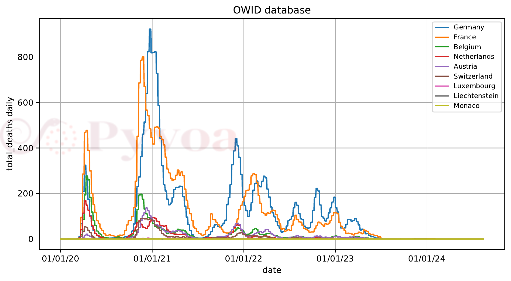
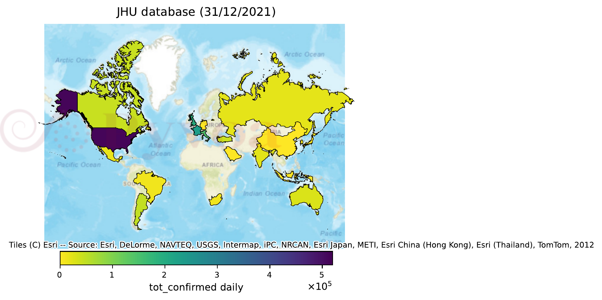
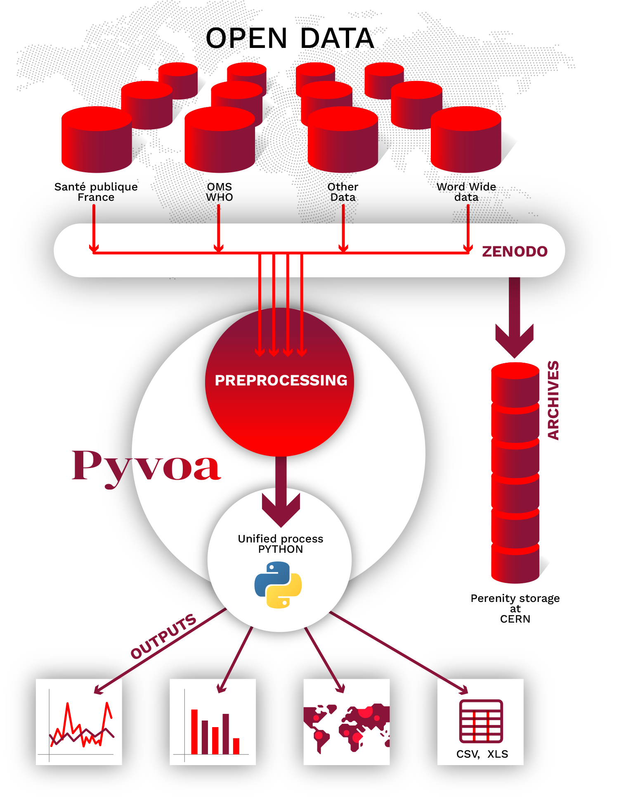

**pyvoa** (Python Virus Open Analysis) is an open-source Python library giving
unified access to epidemiological databases, a standardised data format,
transparent joins with geolocation data, and built-in time-series and
cartographic visualisation.

It is meant to be usable by non-specialists — high-school and university
students, science journalists, researchers unfamiliar with data extraction —
while remaining scriptable for advanced Python users.

Install with ``pip install pyvoa``, or ``pip install pyvoa-full`` for every
visualisation backend.

Comparing countries
-------------------

.. code-block:: python

   import pyvoa.front as pf
   pf.setwhom('owid')            # Our World in Data, worldwide, by country
   pf.setvis('matplotlib')
   pf.plot(which='total_deaths', where='Western Europe',
           what='daily', option='smooth7')

``where='Western Europe'`` expands to the nine states of the United Nations
geoscheme subregion — Switzerland, Liechtenstein and Monaco among them, so the
grouping is not the European Union and does not have to be. ``what='daily'``
differentiates the cumulative series the source publishes, and
``option='smooth7'`` applies a weekly rolling mean, which removes the
reporting-day artefact visible in every national series.

         seven-day smoothed
   :width: 95%
   :align: center

   What those five lines draw. Selecting the database, resolving the country
   names and joining the geography are all done for you.

Mapping a grouping
------------------

.. code-block:: python

   pf.setwhom('jhu')             # Johns Hopkins CSSE, worldwide
   pf.map(which='tot_confirmed', where='G20',
          what='daily', when='31/12/2021')

One keyword selects the G20 member states and the geolocation layer supplies
their geometries; countries outside the grouping are left unpainted.

         COVID-19 cases on 31 December 2021
   :width: 95%
   :align: center

   The same four keywords, drawn geographically instead of against time.

Both listings are the first two examples of the `software paper
<https://github.com/pyvoa/pyvoa/tree/main/paper>`_, and are run verbatim by
``examples/pyfiles/paper_examples.py``, which writes the figures above.

How it fits together
--------------------

         then a unified Python interface, then charts, maps and tables
   :width: 60%
   :align: center
   :name: fig-architecture

   Each database is described by a JSON file rather than by code, so the
   catalogue grows without the library changing. The sources are mirrored on
   Zenodo, which is what makes a given release reproducible; the geolocation
   layer reconciles the location identifiers; and the result is one pandas
   DataFrame that any of the backends can draw.

.. toctree::
   :maxdepth: 2
   :caption: Contents

   api/index

Links
-----

* Project site: https://pyvoa.org
* Source: https://github.com/pyvoa/pyvoa
* Package: https://pypi.org/project/pyvoa/

Indices
-------

* :ref:`genindex`
* :ref:`modindex`
* :ref:`search`
