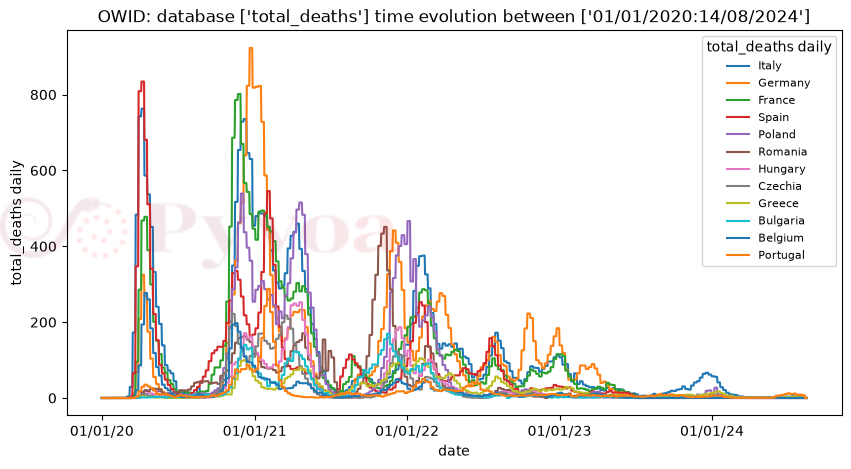

.. figure:: _static/img/logo-pyvoa-x80.png 
   :alt: Pyvoa logo
   :align: center

**pyvoa** (Python Virus Open Analysis) is an open-source Python library giving
unified access to epidemiological databases, a standardised data format,
transparent joins with geolocation data, and built-in time-series and
cartographic visualisation.

It is meant to be usable by non-specialists — high-school and university
students, science journalists, researchers unfamiliar with data extraction —
while remaining scriptable for advanced Python users.

.. code-block:: python

   import pyvoa.front as pf

   pf.setvis('matplotlib')
   pf.setwhom('owid')
   pf.plot(where=['France', 'Italy'], which='tot_cases', what='daily')

Install with ``pip install pyvoa``, or ``pip install pyvoa-full`` for every
visualisation backend.

   What those three lines draw. Selecting the database, resolving the country
   names and joining the geography are all done for you.

How it fits together
--------------------

.. figure:: _static/img/architecture.png
   :alt: Open data sources feed a Zenodo archive, then pyvoa preprocessing,
         then a unified Python interface, then charts, maps and tables
   :width: 60%
   :align: center
   :name: fig-architecture

   Each database is described by a JSON file rather than by code, so the
   catalogue grows without the library changing. The sources are mirrored on
   Zenodo, which is what makes a given release reproducible; the geolocation
   layer reconciles the location identifiers; and the result is one pandas
   DataFrame that any of the backends can draw.

.. toctree::
   :maxdepth: 2
   :caption: Contents

   api/index

Links
-----

* Project site: https://pyvoa.org
* Source: https://github.com/pyvoa/pyvoa
* Package: https://pypi.org/project/pyvoa/

Indices
-------

* :ref:`genindex`
* :ref:`modindex`
* :ref:`search`
